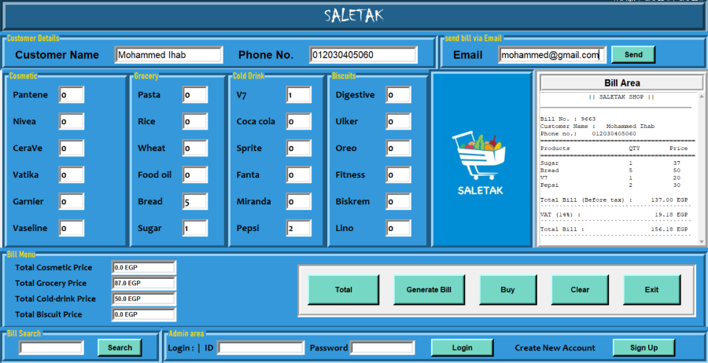
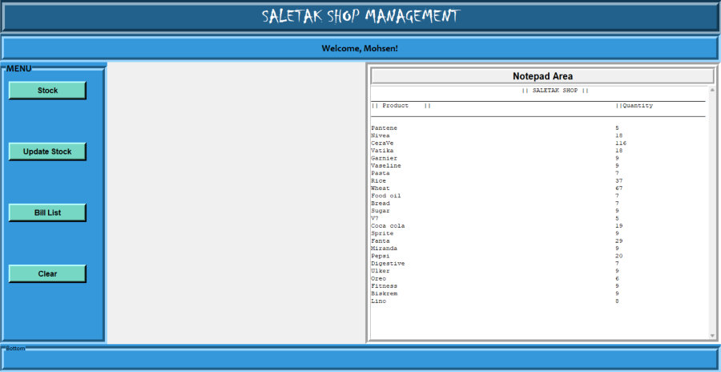
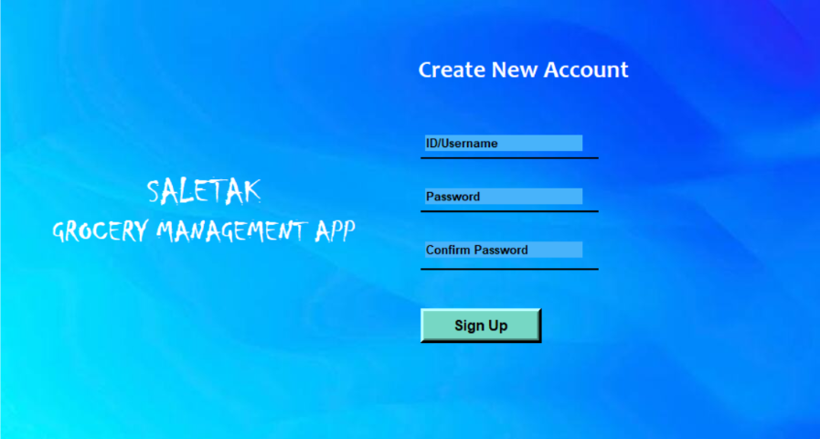

# 🛒 Grocery Management App – Python + Tkinter

A desktop-based Grocery Management System built with **Python**, **Tkinter**, **SQLite**, and **CSV**. Designed for small store operations, this app provides a smooth and simple interface for inventory tracking, billing, and admin management.

Developed as a group project by **Mohammed Ihab**, **Abdelrahman Hatem**, and **Abdelrahman Mohamed**.

---

## ✨ Features

- 🔐 **Admin Login & Signup**  
  Secure login system using SQLite. Admins can sign up with a new username and password.

- 📦 **Product Management**  
  - Stock stored in CSV file  
  - Products organized into **4 categories**  
  - Quantity management via CSV  
  - Prices are hardcoded  
  - Admins can open and edit the CSV directly from the app  

- 🧾 **Billing System**  
  - Generate and display customer bills  
  - Save bills to a folder  
  - Send bills to customers via email  

- 🖥️ **Graphical User Interface**  
  - Built using Python’s Tkinter library  
  - Custom logo added  
  - Three main windows: **Main Page**, **Admin Page**, and **Signup Page**

---

## 🖼️ GUI Screenshots

- **Main Page**



- **Admin Page**



- **Signup Page**



---

## 🛠️ Technologies Used

- Python 3
- Tkinter (built-in GUI library)
- SQLite (for admin credentials)
- CSV files (for stock/product data)
- `pandas` (CSV operations)
- `Pillow` (`PIL`) for image handling
- `smtplib`, `ssl`, `email` (for sending bills via email)
- Standard libraries: `random`, `os`, `subprocess`

---

## 📁 Project Structure
```
📁 grocery-management/
┣ 📄 grocery_management.py  # Main application file (entry point)
┣ 📁 gui_windows/           # Folder containing GUI window classes
┃ ┣ 📄 main_page.py           # Main window class
┃ ┣ 📄 admin_page.py          # Admin dashboard class
┃ ┣ 📄 signup_page.py         # Signup window class
┃ ┗ 📄 loading.py             # Loading box class
┣ 📁 db/                    # Database and data files
┃ ┣ 📄 users.db               # Admin usernames and passwords (SQLite)
┃ ┗ 📄 stock.csv              # Product stock and quantity data
┣ 📁 assets/                # Images and logos used in the app
┃ ┣ 📄 main_page.png          # Screenshot for main page
┃ ┣ 📄 admin_page.png         # Screenshot for admin page
┃ ┣ 📄 signup_page.png        # Screenshot for signup page
┃ ┣ 📄 signup_bg.jpg          # Background image for signup page
┃ ┗ 📄 saletak_logo.jpg       # Store logo
┣ 📁 bills/                 # Folder where saved bills are stored
┗ 📄 README.md
```

## 🚀 Getting Started

### Prerequisites
Make sure ##Python 3## is installed on your system.  
You can check by running:
```bash
python --version
```
Install ##PIL## and ##pandas## as they are ##NOT## part of python standard library
```bash
pip install Pillow
pip install pandas
````

---

### Clone the Repository
```bash
https://github.com/Mohammed-Ihab/grocery-management-gui-python.git
```

---

### Run the Application
```bash
cd grocery-management-gui-python
python grocery_management.py
```

---


## 📌 Notes
- Admin credentials are stored in a local SQLite users.db file.
- Product stock is managed via a .csv file that the app can open directly for editing.
- Generated bills can be saved and emailed directly from the app.
- The app uses hardcoded product pricing — future versions may support editable pricing.
- Email will not work since it is commented out. It will need to be uncommented, and email and password of the store or developer must be edited in code.

---

## 📜 License

This project is for educational purposes. Feel free to reuse or modify it for learning.
